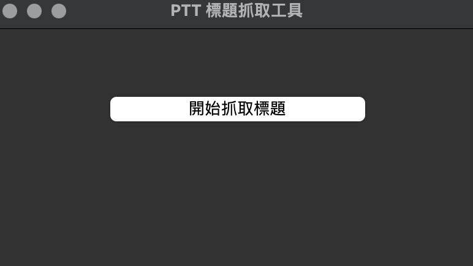

# 📰 PTT Gossiping 標題抓取工具

這是一個使用 Python + Selenium 製作的簡易工具，可以從 [PTT 批踢踢](https://www.ptt.cc/bbs/Gossiping/index.html) 的 Gossiping 八卦板自動抓取文章標題並儲存成 CSV 檔案，並有基本的圖形介面（GUI）供使用者操作。

---

## 📌 功能介紹

- ✅ 開啟 Gossiping 看板
- ✅ （如需要）通過年齡驗證
- ✅ 抓取目前頁面上的文章標題
- ✅ 儲存為 `ptt_titles.csv` 檔案
- ✅ 使用 Tkinter 製作 GUI 介面，一鍵操作

---

## 🖥️ 畫面截圖

### 主程式畫面：
 <!-- 請將實際圖片放在 images 資料夾 -->

### 產出檔案（CSV）示意：
| 編號 | 標題 |
|------|------|
| 1    | [問卦] 台灣股市又噴了？ |
| 2    | [新聞] 柯文哲最新民調曝光！ |
| ...  | ... |

---

## 🛠️ 安裝方式

1. 安裝 [Python 3.11](https://www.python.org/downloads/)
2. 安裝必要套件：
   ```bash
   pip install selenium webdriver-manager


## 🛠️ 執行程式
python3 ptt.py

